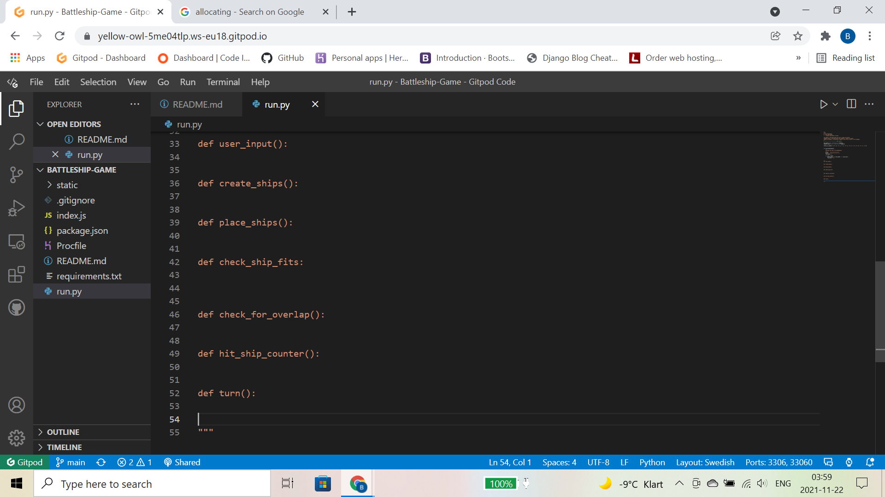

# Battleships 

For my third project with code institute I have decided to make a battleships game using only python.
The game rules are:  
The user places 5 ships on their battle grid, the sizes are as follows. 
2, 3, 3, 4, 5.  
The computer will also place their ships on their own grid.
Once all ships have been placed the game will begin. First one to sink their opponent's battleships will win. 
The grid will be 9 by 9.  
Keys:  
X = Hit  
O = Miss  

Grid:  
  1 2 3 4 5 6 7 8 9  
1 - - - - - - - - -  
2 - - - - - - - - -  
3 - - - - - - - - -  
4 - - - - - - - - -  
5 - - - - - - - - -  
6 - - - - - - - - -  
7 - - - - - - - - -  
8 - - - - - - - - -  
9 - - - - - - - - -  

## Build

To start building this project, I felt that it was best to start by building the game baords, that way I have somrthing I can look at as I progress through the build. It also helps me with tests, as I will be able to see what is going on as I write.  
To help me stay focused on what needs to be done I added commented out functions that will need to be created in order to get the game working properly.  

Link to understand string formatting

https://stackoverflow.com/questions/4288973/whats-the-difference-between-s-and-d-in-python-string-formatting/56382046

## Tests

I ran various tests at regular intervals to ensure that the code I was writing was working and if it wasn't then I would always roughly know where the problem was.  
The first test I ran was just to check that the game boards printed out ok and look good, as pictures below:  
